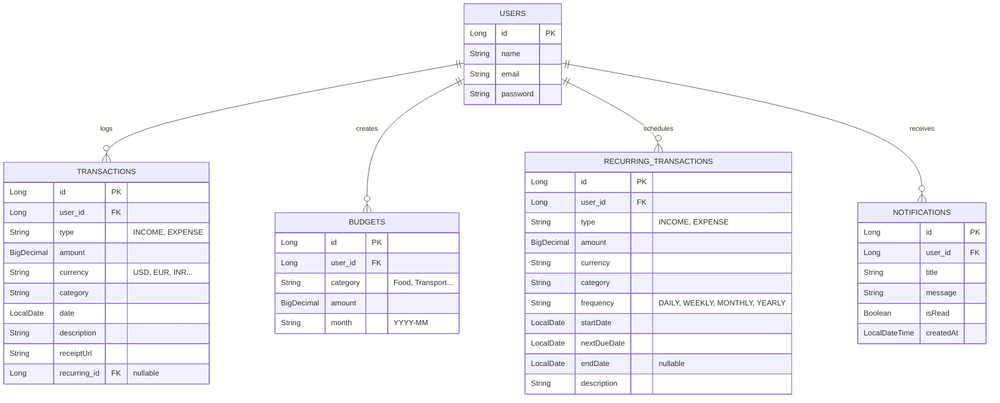

# Database Entity Relationship Diagram

This diagram maps out the structure of the MySQL database supporting Finova.

```mermaid
erDiagram
    USERS ||--o{ TRANSACTIONS : "logs"
    USERS ||--o{ BUDGETS : "creates"
    USERS ||--o{ RECURRING_TRANSACTIONS : "schedules"
    USERS ||--o{ NOTIFICATIONS : "receives"

    USERS {
        Long id PK
        String name
        String email
        String password
    }

    TRANSACTIONS {
        Long id PK
        Long user_id FK
        String type "INCOME, EXPENSE"
        BigDecimal amount
        String currency "USD, EUR, INR..."
        String category
        LocalDate date
        String description
        String receiptUrl
        Long recurring_id FK "nullable"
    }

    BUDGETS {
        Long id PK
        Long user_id FK
        String category "Food, Transport..."
        BigDecimal amount
        String month "YYYY-MM"
    }

    RECURRING_TRANSACTIONS {
        Long id PK
        Long user_id FK
        String type "INCOME, EXPENSE"
        BigDecimal amount
        String currency
        String category
        String frequency "DAILY, WEEKLY, MONTHLY, YEARLY"
        LocalDate startDate
        LocalDate nextDueDate
        LocalDate endDate "nullable"
        String description
    }

    NOTIFICATIONS {
        Long id PK
        Long user_id FK
        String title
        String message
        Boolean isRead
        LocalDateTime createdAt
    }
```
